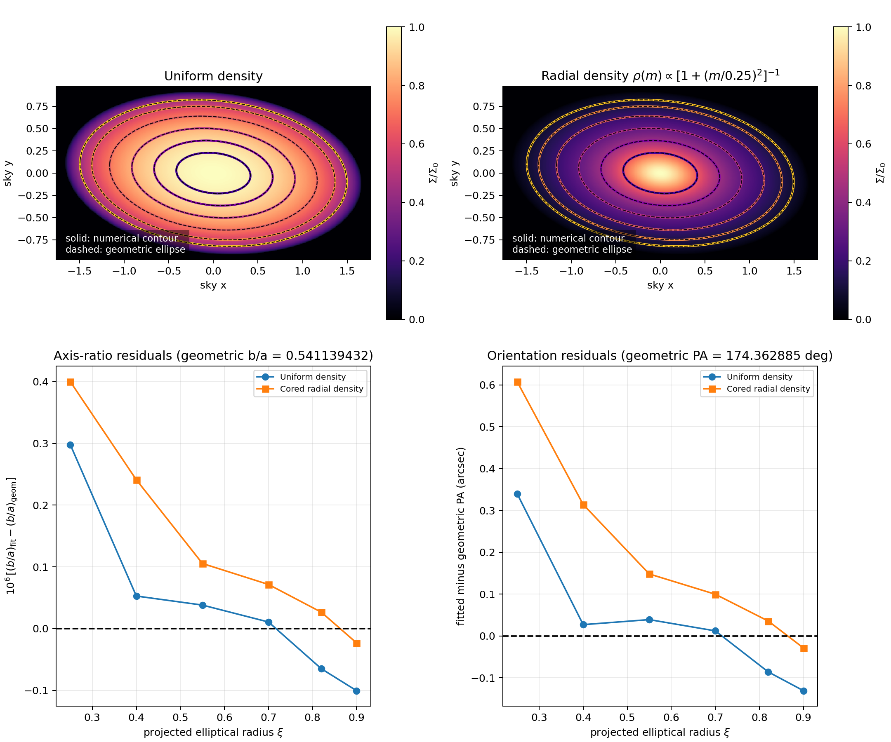

# TriaxProject

`triaxproject` is a compact numerical package for projecting a triaxial
ellipsoid along an arbitrary line of sight. It covers:

1. a uniform-density ellipsoid; and
2. any density stratified on similar ellipsoids, $\rho=\rho(m)$, within a
   finite outer shell $m_{\max}$, where

   $$
   m^2=(\boldsymbol{x}-\boldsymbol{x}_0)^{\mathsf T}
       A(\boldsymbol{x}-\boldsymbol{x}_0).
   $$

It creates raw line-of-sight surface-density maps, evaluates analytic and Abel
references, extracts contours from raster maps, and fits their centers, axis
ratios, ellipticities, and position angles.



## Analytic derivation

### Ellipsoidal geometry and an arbitrary line of sight

Let the intrinsic semiaxes be $(a,b,c)$, let $Q$ be the rotation from the
principal-axis frame into world coordinates, and define

$$
A = Q\,\mathrm{diag}(a^{-2},b^{-2},c^{-2})\,Q^{\mathsf T}.
$$

The ellipsoidal radius of a point $\boldsymbol r$ relative to the center
$\boldsymbol r_0$ is

$$
m^2=(\boldsymbol r-\boldsymbol r_0)^{\mathsf T}
    A(\boldsymbol r-\boldsymbol r_0).
$$

The shell $m=1$ therefore has semiaxes $(a,b,c)$, while an outer truncation
$m=M$ has semiaxes $(Ma,Mb,Mc)$. The density models considered here have
$\rho=\rho(m)$, so all intrinsic isodensity shells are concentric, coaxial,
and similar.

Choose a unit line-of-sight vector $\boldsymbol n$ and a $3\times2$ matrix
$P=(\boldsymbol e_x,\boldsymbol e_y)$ whose columns form an orthonormal sky
basis. Thus $P^{\mathsf T}P=I$ and $P^{\mathsf T}\boldsymbol n=0$. A point on
the ray through sky coordinate $\boldsymbol R=(x,y)^{\mathsf T}$ is

$$
\boldsymbol r-\boldsymbol r_0=P\boldsymbol R+\boldsymbol n s,
$$

where $s$ is physical distance along the line of sight. Define

$$
\alpha=\boldsymbol n^{\mathsf T}A\boldsymbol n,\qquad
\boldsymbol d=P^{\mathsf T}A\boldsymbol n,\qquad
C=P^{\mathsf T}AP.
$$

Substitution gives the quadratic along the ray,

$$
m^2=\alpha s^2+2s\,\boldsymbol d^{\mathsf T}\boldsymbol R
    +\boldsymbol R^{\mathsf T}C\boldsymbol R.
$$

Completing the square yields

$$
m^2=\alpha(s-s_c)^2+\xi^2,
\qquad
s_c=-\frac{\boldsymbol d^{\mathsf T}\boldsymbol R}{\alpha},
$$

with projected elliptical radius

$$
\xi^2=\boldsymbol R^{\mathsf T}B\boldsymbol R,
\qquad
B=C-\frac{\boldsymbol d\boldsymbol d^{\mathsf T}}{\alpha}.
$$

The projected boundary of the shell $m=M$ is consequently the ellipse
$\boldsymbol R^{\mathsf T}B\boldsymbol R=M^2$. For numerical stability the
code evaluates the algebraically equivalent form

$$
B=\left(P^{\mathsf T}A^{-1}P\right)^{-1},
$$

which avoids subtracting nearly equal matrices for very elongated ellipsoids.

### Projection of a general radial profile

The surface density is the line-of-sight integral

$$
\Sigma(\boldsymbol R)=\int \rho(m)\,ds.
$$

Inside a finite outer shell $m\le M$, set
$t=\sqrt{\alpha}(s-s_c)$. Since $m^2=\xi^2+t^2$, the two sides of the chord
give

$$
\boxed{
\Sigma(\xi)=\frac{2}{\sqrt{\alpha}}
\int_0^{\sqrt{M^2-\xi^2}}
\rho\!\left(\sqrt{\xi^2+t^2}\right)dt
}
\qquad (0\le\xi\le M).
$$

Changing the integration variable from $t$ to $m$ gives the equivalent Abel
form

$$
\boxed{
\Sigma(\xi)=\frac{2}{\sqrt{\alpha}}
\int_{\xi}^{M}\frac{\rho(m)m}{\sqrt{m^2-\xi^2}}\,dm
}.
$$

This proves that the projected density depends on sky position only through
$\xi$, regardless of the particular function $\rho(m)$.

### Why every contour has the same ellipticity

Let the eigenvalues of the positive-definite matrix $B$ be
$0<\lambda_1\le\lambda_2$, and rotate the sky coordinates into its
eigenvectors, $(u,v)$. A contour of constant $\xi$ obeys

$$
\lambda_1u^2+\lambda_2v^2=\xi^2
$$

and therefore has projected semiaxes

$$
a_{\mathrm{proj}}=\frac{\xi}{\sqrt{\lambda_1}},\qquad
b_{\mathrm{proj}}=\frac{\xi}{\sqrt{\lambda_2}}.
$$

Their ratio is

$$
\boxed{
q_{\mathrm{proj}}=\frac{b_{\mathrm{proj}}}{a_{\mathrm{proj}}}
=\sqrt{\frac{\lambda_1}{\lambda_2}}
},
$$

which is independent of $\xi$ and of $\rho(m)$. Thus one projection has one
center, position angle, and axis ratio at every surface-density level. The
axis ratio itself generally changes when the viewing direction changes. This
package reports ellipticity using $\epsilon=1-q_{\mathrm{proj}}$.

For a monotonic profile, each value of $\Sigma$ corresponds to a single
ellipse. A non-monotonic profile can produce several nested ellipses at the
same $\Sigma$, but all of them still have the same axis ratio and orientation.

### Closed-form benchmark profiles

The analytic functions shipped with the package implement the following
finite-support results.

For uniform density, $\rho(m)=\rho_0$,

$$
\boxed{
\Sigma(\xi)=\frac{2\rho_0}{\sqrt{\alpha}}
\sqrt{M^2-\xi^2}
}.
$$

For the polynomial family

$$
\rho(m)=\rho_0\left[1-\left(\frac{m}{M}\right)^2\right]^p,
\qquad 0\le m\le M,
$$

the result is

$$
\boxed{
\Sigma(\xi)=\frac{\rho_0M}{\sqrt{\alpha}}
\mathrm{B}\!\left(\frac12,p+1\right)
\left(1-\frac{\xi^2}{M^2}\right)^{p+1/2}
},
$$

where $\mathrm{B}$ denotes the Euler beta function rather than the
projected matrix $B$.

For the truncated cored profile with outer slope two,

$$
\rho(m)=\frac{\rho_0}{1+(m/r_c)^2},\qquad 0\le m\le M,
$$

the projection is

$$
\boxed{
\Sigma(\xi)=
\frac{2\rho_0r_c^2}{\sqrt{\alpha}\sqrt{r_c^2+\xi^2}}
\tan^{-1}\!\left(
\frac{\sqrt{M^2-\xi^2}}{\sqrt{r_c^2+\xi^2}}
\right)
}.
$$

As a simple principal-axis check, viewing
$x^2/a^2+y^2/b^2+z^2/c^2\le1$ along $z$ gives

$$
\Sigma(x,y)=2\rho_0c
\sqrt{1-\frac{x^2}{a^2}-\frac{y^2}{b^2}},
$$

so every contour is immediately seen to be a scaled copy of the boundary
ellipse with axis ratio $b/a$.

### Numerical verification

The worked examples evaluate the full three-dimensional ellipsoidal radius at
every line-of-sight quadrature node. They do not construct the map from a
precomputed $\Sigma(\xi)$. The ellipses are then recovered from interpolated
raster contours rather than simply plotting the analytic contour equations.

## Install

From this directory:

```bash
python -m pip install -e '.[examples]'
```

NumPy and SciPy are runtime dependencies. Matplotlib and ContourPy are included
in the optional `examples` dependency group.

## Quick start

```python
import numpy as np
from triaxproject import (
    PolynomialDensity,
    TriaxialEllipsoid,
    surface_density_los,
)

ellipsoid = TriaxialEllipsoid(axes=(1.8, 1.1, 0.55))
projection = ellipsoid.project(line_of_sight=(0.43, 0.58, 0.69))

x = np.linspace(-1.8, 1.8, 401)
y = np.linspace(-1.0, 1.0, 301)
X, Y = np.meshgrid(x, y)

# rho(m) = rho0 (1-m^2)^2 for m <= 1
profile = PolynomialDensity(rho0=1.0, power=2.0, m_max=1.0)
Sigma = surface_density_los(
    projection, X, Y, profile, m_max=1.0, order=64
)

print(projection.axis_ratio)   # projected b/a
print(projection.ellipticity)  # 1-b/a
print(np.degrees(projection.position_angle))
```

Any vectorized callable can replace the supplied density profiles:

```python
def rho(m):
    return np.exp(-3.0 * np.asarray(m) ** 1.4)
```

`surface_density_los` truncates the integration at the requested `m_max`.
`surface_density_abel` supplies a high-accuracy one-dimensional reference for
the same finite support. If a profile has its own `m_max` attribute, as
`PolynomialDensity` does, the projector infers it when omitted and rejects a
conflicting explicit value. Profiles without an intrinsic cutoff default to
`m_max=1`; pass another value explicitly when needed.

## Run the worked examples

```bash
python examples/worked_examples.py
```

The script uses semiaxes $(1.8,1.1,0.55)$ and the oblique line of sight
proportional to $(0.43,0.58,0.69)$. It produces:

- `example_outputs/constant_ellipticity.png`: maps, numerical contours,
  geometric ellipse overlays, and contour-fit residuals;
- `example_outputs/contour_measurements.csv`: one diagnostic row per contour;
- `example_outputs/example_summary.txt`: a compact human-readable report.

The second example uses the non-polynomial cored profile
$\rho(m)=\rho_0/[1+(m/0.25)^2]$, truncated at $m=1$. For the included
$501\times501$ calculation, the predicted axis ratio is $0.541139431881$. The
fitted $b/a$ range across six contours is about $4.0\times10^{-7}$ for uniform
density and $4.2\times10^{-7}$ for the cored radial profile. The uniform raw
map agrees with its closed form to about $5\times10^{-14}$ of the central
surface density; the non-polynomial cored map agrees with its independent
closed form to about $9\times10^{-11}$.

You can trade resolution for speed:

```bash
python examples/worked_examples.py --grid-size 301 --quadrature-order 32
```

## Tests

The suite uses the standard library's `unittest`, so no test runner is needed.
Install `.[examples]` first because the raster-contour tests use ContourPy:

```bash
python -m unittest discover -s tests -v
```

The tests cover principal and oblique projections, rotated ellipsoids, the
spherical limit, raw LOS quadrature against three closed forms, arbitrary
$\rho(m)$ against the Abel reduction, constancy around predicted ellipses, and
axis-ratio recovery from raster contours.

## API overview

- `TriaxialEllipsoid`: intrinsic axes, orientation, center, and ellipsoidal
  radius.
- `ProjectionGeometry`: sky basis, projected matrix $B$, chord intersections,
  projected semiaxes, $b/a$, $1-b/a$, and position angle.
- `UniformDensity`, `PolynomialDensity`, `CoredPowerLawDensity`: ready-to-use
  profiles.
- `surface_density_los`: direct finite-chord Gauss-Legendre projection.
- `surface_density_abel`: nonsingular Abel-equivalent reference integral.
- `uniform_surface_density_analytic` and
  `polynomial_surface_density_analytic`: closed-form benchmarks.
- `cored_power_law_surface_density_analytic`: non-polynomial closed-form
  benchmark for outer slope two.
- `surface_density_map`: regular raw-LOS raster generation.
- `measure_contour`, `measure_contours`, and `fit_ellipse`: independent contour
  diagnostics.

## Scope and caveats

The fixed-ellipticity result assumes parallel projection and one fixed $A$:
all intrinsic isodensity shells must be concentric, coaxial, and similar. It is
not generally true when axis ratios or orientation vary with radius, when
density is a function of spherical rather than ellipsoidal radius inside an
ellipsoidal boundary, or when substructure is added.

For a non-monotonic $\rho(m)$, one surface-density value can correspond to
multiple nested loops. Each loop is still a similar ellipse, but a level set
need not be a single contour. Position angle is numerically undefined for an
exactly circular projection.

The figure and worked-example scripts are source-tree assets; the minimal wheel
contains the importable library modules but not those auxiliary files.
